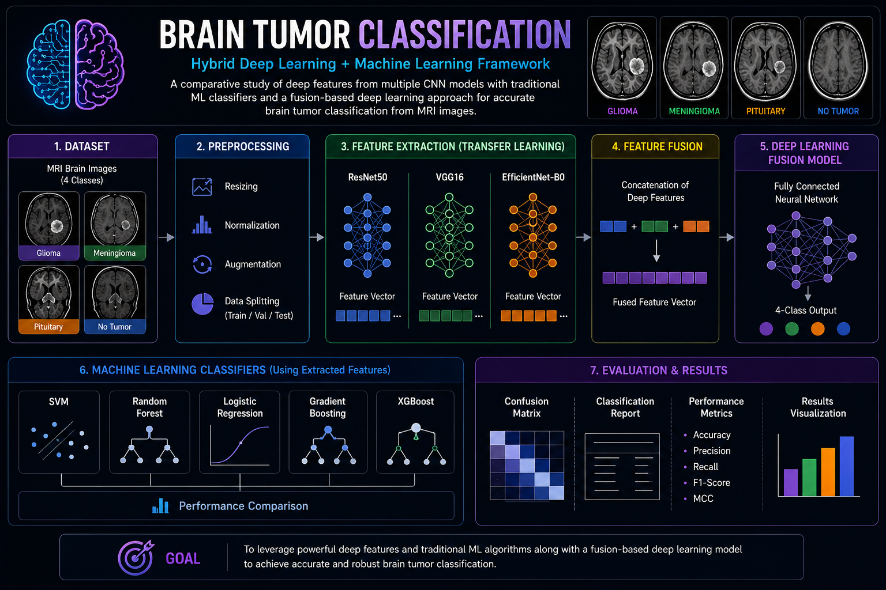

# Brain-tumor-classification
Brain Tumor Classification is a hybrid deep learning and machine learning framework developed for automated brain tumor detection using MRI images. The project focuses on extracting highly discriminative deep features from multiple pretrained CNN architectures including ResNet, VGG16, and EfficientNet-B0.
<p align="center">
  
</p>

<h1 align="center">Brain Tumor Classification</h1>

<h3 align="center">
Hybrid Deep Learning + Machine Learning Framework for MRI Classification
</h3>

<p align="center">
  
  
  
  
  
</p>

---

# Overview

This project presents a hybrid deep learning and machine learning framework for automated brain tumor classification using MRI images. The system focuses on extracting highly informative deep features from multiple pretrained CNN architectures and evaluating them using both traditional machine learning classifiers and fusion-based deep learning models.

The framework performs comparative analysis using multiple feature extractors including:

- ResNet50
- VGG16
- EfficientNet-B0

The extracted deep representations are further analyzed using several machine learning algorithms such as:

- Support Vector Machine (SVM)
- Random Forest
- Logistic Regression
- Gradient Boosting
- XGBoost

In addition to standalone feature evaluation, the project introduces a feature fusion strategy where embeddings from multiple CNN models are combined and passed through a fully connected deep neural network for final classification.

---

# Dataset

The MRI dataset contains four classes:

| Class | Description |
|------|------|
| Glioma | Brain glioma tumor MRI |
| Meningioma | Meningioma tumor MRI |
| Pituitary | Pituitary tumor MRI |
| No Tumor | Normal brain MRI |

---

# Workflow Pipeline

<p align="center">
  
</p>

The complete workflow includes:

1. MRI Image Collection
2. Image Preprocessing
3. Transfer Learning Based Feature Extraction
4. Deep Feature Fusion
5. Machine Learning Classification
6. Deep Learning Fusion Network
7. Performance Evaluation & Visualization

---

# Key Features

- Hybrid Deep Learning + Machine Learning Architecture
- Transfer Learning using pretrained CNN models
- Deep Feature Extraction
- Multi-model Feature Fusion
- Comparative ML Classifier Evaluation
- GPU Optimized Training Pipeline
- Confusion Matrix Visualization
- Classification Reports & Performance Metrics
- Modular Experimental Framework

---

# Performance Metrics

The framework evaluates performance using:

- Accuracy
- Precision
- Recall
- F1-Score
- Matthews Correlation Coefficient (MCC)
- Confusion Matrix
- Classification Report

---

# Project Structure

```bash
brain-tumor-classification/
│
├── assets/
├── dataset/
├── notebooks/
├── src/
├── models/
├── outputs/
│
├── requirements.txt
├── setup.py
├── .gitignore
└── README.md
```

---

# Technologies Used

| Category | Tools |
|------|------|
| Programming Language | Python |
| Deep Learning | PyTorch, TensorFlow |
| Machine Learning | Scikit-learn, XGBoost |
| Image Processing | OpenCV |
| Visualization | Matplotlib, Seaborn |
| Data Handling | NumPy, Pandas |

---

# Research Objective

The primary objective of this work is to investigate how deep feature representations extracted from multiple CNN architectures can improve MRI-based brain tumor classification when integrated with traditional machine learning algorithms and fusion-based deep learning strategies.

---

# Future Improvements

- Attention-based feature fusion
- Vision Transformer integration
- Explainable AI (Grad-CAM)
- Web deployment
- Real-time MRI inference
- Lightweight edge deployment

---

# Author

Developed for research and educational purposes in medical image analysis and intelligent healthcare systems.
